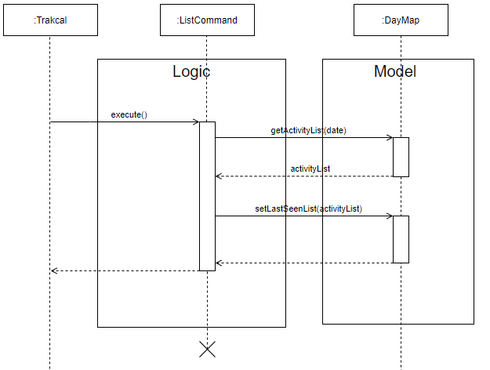

# Developer Guide
 

* Table of Contents
{:toc}

## Setting up

<br/>

### Prerequisites
 * Java 11 (can be download from here)
 * Intellij IDE
    
### Setting up:    
* Download the latest tracKCAL jar file (here)
* Copy jar file into an empty folder in a convenient location (eg. Desktop)
* Open terminal and navigate directory to the folder containing jar file 
* Enter the following command line to run program: ```java -jar tracKCAL.jar```   
* Look through the user guide for a full detailed explanation on the functionality of tracKCAL
    
## Design 

### Architecture

`spaceholder: i obly draw on paper for now`

The Architecture Diagram shown above explains the high-level design of tracKCAL. 

TracKCAL is made up of mainly 6 components.

`traKCAL`: 
`Ui`: displays any message that the user can see and interact with
`Logic`: Interprets what the user inputs
`Command`: Executes specific command according to interpretation by `Logic`
`Storage`: Saves required data into the hard disk or retrieves data 
`Model`: Visualize data into a graph

### Logic component


In the logic component, 

* Trakcal uses the parser class to filter based on command words by user.
* Description that comes after is further parsed down by the Parser.
* Respective Command object is created and is executed by Trackcal.
* Respective execution methods can be further associated with `UI`, `Storage` and `Model` components.

### Storage component

### Model component

*Figure 4. Diagram for Model component*<br>
**API**: Model.java <br>
In the Model component, <br>
* Stores a DayMap object that holds the data for each date.
* Stores an ActivityList that holds the list of Activities, Food or Exercise for each day 
* Does not depend on any of the other components.


## Implementation

### Add feature

### Listing feature for find and list commands
The listing mechanism used by ListCommand and FindCommand to display the required list of activities is facilitated by the lastSeenList of class ActivityList. The following operations could be applied to the lastSeenList which would change the actual data in the database:
* `delete`
* `move`
* `edit (note: edit only moedit only modifies entries in the database after list command)`
The details of those operations can be found further down
#### List
This feature is used to list the entries of a specified date where the extracted activityList would be used as the lastSeenList itself. <br>
The following sequence diagram shows how the lastSeenList is set after a “list date" command where date is of YYYY-MM-DD or after a “list” command where the date is the current date.<br>

Figure 6. Sequence diagram of setting the lastSeenList after a `list` command

### Displaying the list after `find` or `list` commands
####Current implementation
The mechanism used to display the lastSeenList invoked by the list or find commands is facilitated by the listDrawer and findDrawer class respectively. They both work the same way but the list produced by findDrawer has an extra column which contains the dates of the respective entries.
<br>
The following sequence diagram shows how the listDrawer class is used to display the lastSeenList.<br>


### Edit feature

### Chaining feature

### Find feature

### Graph feature

### Move feature
This feature allows the user to manually `move` activities from one position to another position <br>
The following sequence diagram shows how the `move` command is executed, where index1 is the position to be moved from and index 2 is the position to be moved below. <br>


## Appendix: Requirements

### Product scope

#### Target user profile

{Describe the target user profile}
>Tech savvy university students that have knowledge on the exercise and calories or know where to get the information before inputting it in the application.

#### Value proposition

{Describe the value proposition: what problem does it solve?}
* Functionality
    - Provides greater flexibility of use.
    - Can be used to do things that are difficult or impossible to do with a GUI.
* Speed
    - GUI required additional system resource to load the graphical part, thus slower than CLI
    - Less memory usage
* Scripting & automation
    - Have greater control over system functions
    - Commands can be given via a line command and then code does the work whereas in GUI, more than one action have to be repeated to perform a command


### User Stories

|Version| As a ... | I want to ... | So that I can ...|
|--------|----------|---------------|------------------|
|v1.0|new user|see usage instructions|refer to them when I forget how to use the application|
|v1.0|user|add food consumed/exercise done|keep track of my daily activities|
|v1.0|user|list out the activities done for the day|track it and amend it if any errors occur|
|v1.0|user|delete entries entered|remove erroneous entries|
|v1.0|forgetful user|find activities via keyword|pull out the entries that I want|
|v1.0|beginner in working out|track the calories intake|feel assured that my workout is on the right track|
|v1.0|student who is a health enthusiast|keep track of my daily intake of calories|better manage my health|
|v2.0|gym user|upload the amount of calories consumed or lost|track the surplus or deficit of calories|
|v2.0|overweight student|calculate the estimated amount of calories lost|facilitate my weight loss regime|
|v2.0|underweight student|calculate the estimated amount of calories gained|facilitate my weight gain regime|
|v2.0|weight conscious person|track the amount of calories gained or lost|maintain my weight|
|v2.0|careless student|go back and edit entries entered earlier|correct the errors I have made|
|v2.0|frequent user|have pre-set repetitive actions entered by me|save time when inputting data|

### Use Cases

### Non-Functional Requirements

{Give non-functional requirements}

### Glossary

* *glossary item* - Definition
* *GUI* - Graphics User Interface

### Instructions for manual testing

{Give instructions on how to do a manual product testing e.g., how to load sample data to be used for testing}
