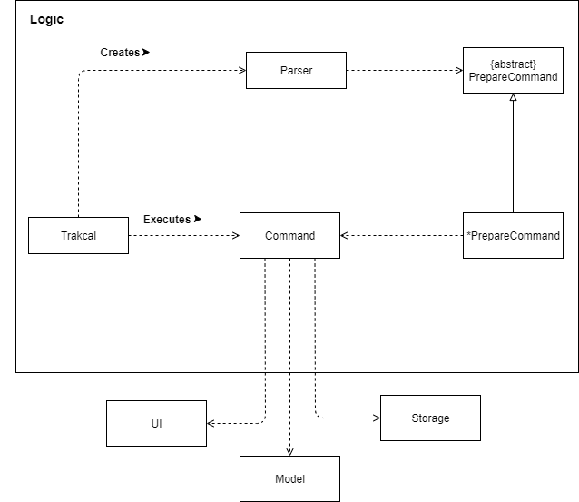
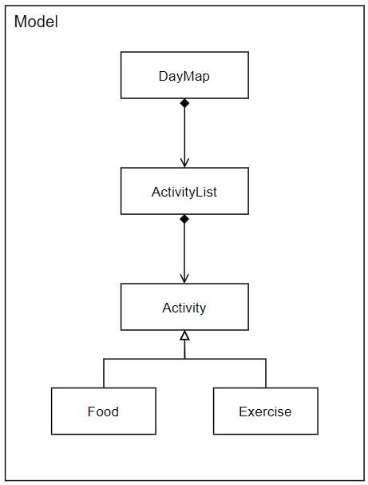
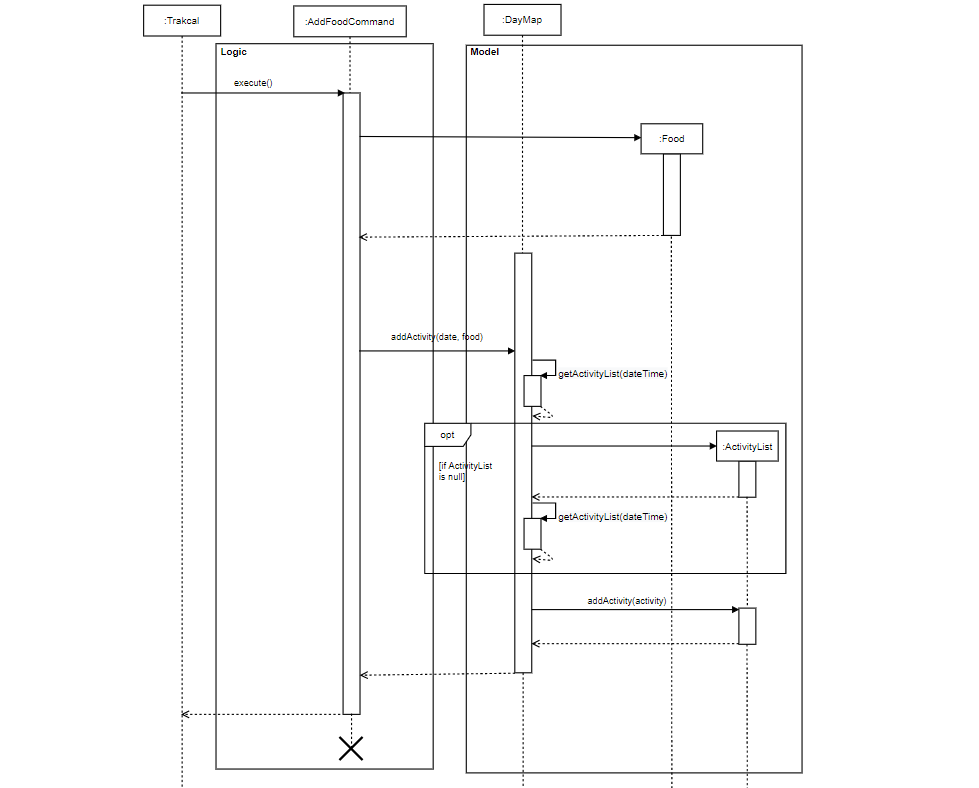
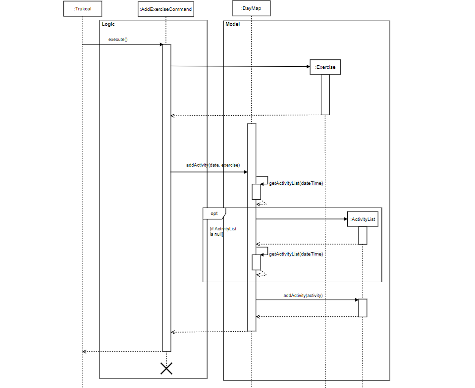
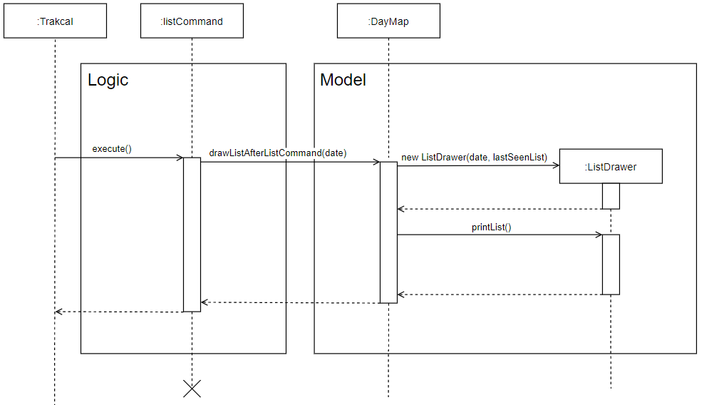
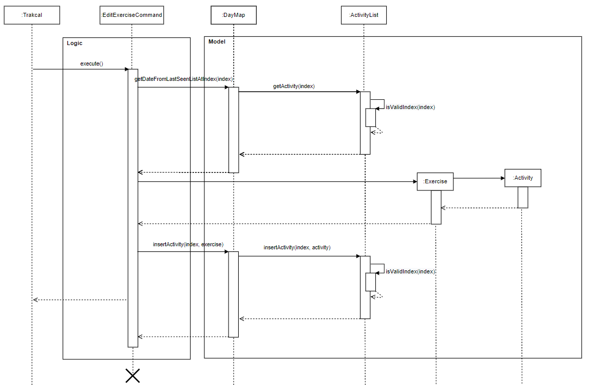
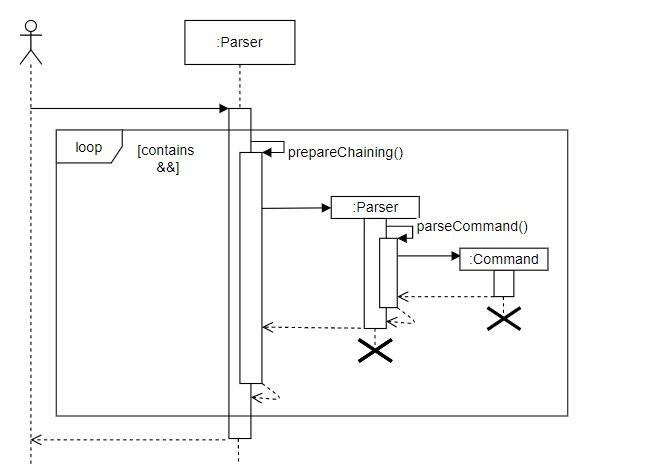

# Developer Guide for traKCAL

The purpose of this developer guide is as reference for future collaborators of **trakCAL**.

By: CS2113-T09-4    Since: October 2020   Licence: MIT

<br>

## 1.0 Introduction

**Welcome to traKCAL!**

**traKCAL** is a desktop application for managing and visualizing your calorie intake, optimized for use via Command Line Interface (CLI) whilst retaining the benefits of a Graphical User Interface (GUI). 

This guide will provide information on the design and implementation of **traKCAL**. It will help you get started on your journey of becoming a contributor to **traKCAL**. 
This guide will also explain the various features available in **traKCAL**, to provide you with a better understanding of the current version of **traKCAL**

<br>

## Table of Contents

* Table of Contents
{:toc}

<br>

## 2.0 Setting up

### 2.1 Prerequisites
 * Java 11 (can be download from [here](https://docs.aws.amazon.com/corretto/latest/corretto-11-ug/downloads-list.html))
 * Intellij IDE
 
<br>
    
### 2.2 Setting up:    
* Download the latest **traKCAL** jar file ([here](https://github.com/AY2021S1-CS2113T-T09-4/tp/releases))
* Copy jar file into an empty folder in a convenient location (eg. Desktop)
* Open terminal and navigate directory to the folder containing jar file 
* Enter the following command line to run program: ```java -jar traKCAL.jar```   
* Look through the user guide for a full detailed explanation on the functionality of **traKCAL**
    
<br>
<br>    
    
## 3.0 Design 

### 3.1 Architecture


*Figure 1. Diagram for Model component*

The Architecture Diagram shown above explains the high-level design of **traKCAL**.

**traKCAL** is made up of mainly 8 components.

`trakCAL`: tracKCAL starts here

`Ui`: Displays any message that the user can see and interact with

`Logic`: Interprets what the user input

`Command`: Executes specific command according to interpretation by `Logic`

`Storage`: Saves required data into the hard disk or retrieves data

`Model`: Structure of the data

`Exception`: 

`UserProfile`:

<br>

### 3.2 Logic component



*Figure 2. Diagram for logic component*

The main bulk of data processing takes place in the logic component. In this component, 
the data from the userinput is checked for its validity and parsed down futher to its respective command blocks.
These blocks of command are derived from the abstract Command class. Each different command block deals with the 
proposed functionality which can be associated with `Ui`,`storage` or `model` components. 

* **traKCAL** uses the parser class to filter based on command words by user.
* Description that comes after is further parsed down by the Parser.
* Respective Command object is created and is executed by **traKCAL**.
* Respective execution methods can be further associated with `UI`, `Storage` and `Model` components.

<br>

### 3.3 Model component



*Figure 3. Diagram for Model component*


In the Model component, 

* Stores a DayMap object that holds the data for each date.
* Stores an ActivityList that holds the list of Activities, Food or Exercise for each day 
* Does not depend on any of the other components.

<br>
<br>

## 3.0 Implementation

### 3.1 Create User Profile

The sequence diagram below shows how the components will react to a new user or for a returning user. 


*Figure 4. Components interactions for tracKCAL checks for new or existing user*

<br>
<br>

### 3.2 Add activity feature

#### 3.2.1 Current Implementation

The adding mechanism is used by `AddFoodCommand` and `AddExerciseCommand` to add to the list of date stated in user input.

The following Sequence Diagram shows how `AddFoodCommand` is carried out when the user issues add command, in this case, `add f/ food c/ 170 d/ 2020-10-22`:



*Figure 5. Component interactions for add food command*

> `AddExerciseCommand` diagram has a similar logic.



*Figure 6. Component interactions for add exercise command*

<br>

#### 3.2.2 Design Considerations

Aspect: How to add activity

>Alternative 1(current choice): Using single letter words as tags for input commands. (e.g. add f/ XXX c/ XXX d/ XXX)
>* Pros: Faster and shorter input keys for user.
>* Cons: Have to ensure that user is clear on what tags to input.

>Alternative 2: Using full words as tags for input commands. (e.g. add food/ XXX calorie/ XXX date/ XXX)
>* Pros: Tags are obvious in what input is expected.
>* Cons: More wordy input needed from user.

<br>
<br>

### 3.3 Listing feature for find and list commands
The listing mechanism used by `ListCommand` and `FindCommand` to display the required list of activities is facilitated by the lastSeenList of class `ActivityList`. 
The following operations could be applied to the lastSeenList which would change the actual data in the database:

- delete
- move
- edit (note: edit only modifies entries in the database after list command)

The details of those operations can be found further down.

<br>

#### 3.3.1 List

This listing feature uses the lastSeenList which is of ActivtyList class.  <br>
The lastSeenList is the list that the user would see after a `list` or `find` command. <br>
For example, 
* A `list 2020-11-11` command would use the activityList for 2020-11-11 as the lastSeenList.<br>
* A `find e/ food` command would go throught the dayMap and add activities containing the keyword/s into the lastSeenList.
Using the lastSeenList allows users to make changes e.g `edit`, `delete`, `move` commands using the numbered index of a single `list` or `find` command.

The following sequence diagram shows how the lastSeenList is set after a “list date" command where date is of YYYY-MM-DD or after a “list” command where the date is the current date.


*Figure 6. Sequence diagram of setting the lastSeenList after a `list` command*

<br>
<br>

#### 3.3.2 Find

The editing mechanism is used by the basic find features: `FindDescriptionCommand`, `FindCalorieCommand`, 
as well as the advanced find features: `FindAllCommand` and `FindEitherCommand` to look for keywords in the list.

The following sequence diagram shows how the lastSeenList is set after a find command.


*Figure 7. Sequence diagram of setting the lastSeenList after a find command*

<br>
<br>

### 3.4 Displaying the list after `find` or `list` commands

#### 3.4.1 Current implementation
The mechanism used to display the lastSeenList invoked by the list or find commands is facilitated by the listDrawer and findDrawer class respectively. They both work the same way but the list produced by findDrawer has an extra column which contains the dates of the respective entries.

The following sequence diagram shows how the listDrawer class is used to display the lastSeenList.



*Figure 8. Sequence diagram of the usage of listDrawer to display the list*

<br>
<br>

### 3.5 Edit activity in list feature

#### 3.5.1 Current Implementation

The editing mechanism is used by `EditFoodCommand` and `EditExerciseCommand` to amend the current list of activities.

The following Sequence Diagram shows how `EditFoodCommand` is carried out when the user issues edit command, in this case, `edit 1 f/ egg c/ 10`:


*Figure 9. Sequence diagram of edit food feature*

> `EditExerciseCommand` diagram has a similar logic.



<br>

#### 3.5.2 Design Considerations

Aspect: How to edit activity

>Alternative 1 (current choice): Same command able to edit both activities, food and exercise in list.
>* Pros: Able to guarantee that no abnormal behaviour will happen.
>* Cons: Have to ensure that the different type of editing is implemented correctly.

>Alternative 2: Have separate commands for editing the different activity type.
>* Pros: Clear distinction of the classes.
>* Cons: Increase in number of lines. Separate methods with similar logic will be created.

<br>
<br>

### 3.6 Chaining feature

#### 3.6.1 Current Implementation

The chaining mechanism can be used by the various commands available The following are the types of command that can be chained:
- list
- add
- edita

The following sequence diagram shows how the chaining works after command is entered:



*Figure 10. Sequence diagram of chaining feature*

<br>

#### 3.6.2 Design Considerations

Aspect: Which features to chain

>Alternative 1 (current choice): Allow only certain commands to be chained.
>* Pros: Able to guarantee that no abnormal behaviour will happen.
>* Cons: User must know which commands can be chained.

>Alternative 2: Allow all commands to be chained.
>* Pros: Easy to implement.
>* Cons: May give abnormal behaviour.

<br>
<br>

### 3.7 Move feature
This feature allows the user to manually `move` activities from one position to another position 

The following sequence diagram shows how the `move` command is executed, where index1 is the position to be moved from and index 2 is the position to be moved below. 


*Figure 11. Sequence diagram of move feature*

<br>
<br>

### 3.8 Graph feature

The graph implementation shows the progress of the daily net 
calories over the period of 7 days. The GraphProperty class extracts the available days from the 
hashmap.

The days are sorted accordingly and the latest 7 days are chosen from the sorted list. 
The properties of the graph such as axis range are also calculated. The GraphDrawing class makes use of these properties
to draw the graph.


*Figure 12. Sequence diagram of move feature*

As shown above, when the execute command of GraphCommand is called, the GraphProperty object 
is created, the properties of the graph are then stored and calculated in setProperty function.

Next, the graphDrawing object is created and uses the properties calculated earlier to print out the graph.
> In the case where there are less than 7  days stored, all the days will be displayed.

<br>
<br>

## 4.0 Appendix: Requirements

### 4.1 Product scope

#### 4.1.1 Target user profile

{Describe the target user profile}
* Tech savvy university students that have knowledge on the exercise and calories or know where to get the information before inputting it in the application.
    - Can type fast
    - Prefers desktop applications
    - Prefers typing to mouse interactions
    - Conscious about daily calorie intake
    - Conscious about weight
    - Is reasonably comfortable using CLI applications

<br>

#### 4.1.2 Value proposition

{Describe the value proposition: what problem does it solve?}
* Functionality
    - Provides greater flexibility of use.
    - Can be used to do things that are difficult or impossible to do with a GUI.
* Speed
    - GUI required additional system resource to load the graphical part, thus slower than CLI
    - Less memory usage
* Scripting & automation
    - Have greater control over system functions
    - Commands can be given via a line command and then code does the work whereas in GUI, more than one action have to be repeated to perform a command

<br>

### 4.2 User Stories

|Version| As a ... | I want to ... | So that I can ...|
|--------|----------|---------------|------------------|
|v1.0|new user|see usage instructions|refer to them when I forget how to use the application|
|v1.0|user|add food consumed/exercise done|keep track of my daily activities|
|v1.0|user|list out the activities done for the day|track it and amend it if any errors occur|
|v1.0|user|delete entries entered|remove erroneous entries|
|v1.0|forgetful user|find activities via keyword|pull out the entries that I want|
|v1.0|beginner in working out|track the calories intake|feel assured that my workout is on the right track|
|v1.0|student who is a health enthusiast|keep track of my daily intake of calories|better manage my health|
|v2.0|gym user|upload the amount of calories consumed or lost|track the surplus or deficit of calories|
|v2.0|overweight student|calculate the estimated amount of calories lost|facilitate my weight loss regime|
|v2.0|underweight student|calculate the estimated amount of calories gained|facilitate my weight gain regime|
|v2.0|weight conscious person|track the amount of calories gained or lost|maintain my weight|
|v2.0|careless student|go back and edit entries entered earlier|correct the errors I have made|
|v2.0|frequent user|have pre-set repetitive actions entered by me|save time when inputting data|

<br>

### 4.3 Non-Functional Requirements

{Give non-functional requirements}

1. Should work on any mainstream OS as long as it has Java 11 or above installed.
2. A user with above average typing speed for regular English text (i.e. not code, not system admin commands) should be able to accomplish most of the tasks faster using commands than using the mouse.

<br>

### 4.4 Glossary

* *glossary item* - Definition
* *GUI* - Graphics User Interface
* *CLI* - Command Line Interface
* *OS* - Operating System
* *mainstream OS* - Windows, Linus, MacOS, OS-X, Unix
* *API* - Application Programming Interface
* *MSS* - Main Success Scenario

<br>

### 4.5 Instructions for manual testing

{Give instructions on how to do a manual product testing e.g., how to load sample data to be used for testing}

>These instructions only provide a starting point for testers to work on; testers are expected to do more exploratory testing.

*To be implemented soon*
